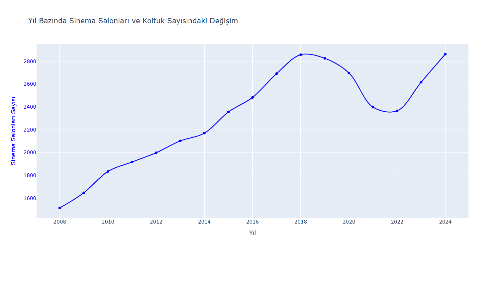

# Cinema Data Analysis (Python)

This project is a data analysis and visualization study based on cinema audience statistics.  
The dataset was analyzed using Python to understand audience trends and relationships between cinema halls and attendance.

## Project Purpose
The aim of this project is to examine yearly audience changes and analyze the relationship between cinema hall capacity and audience numbers.

## Features
- Reading dataset using pandas
- Data grouping and statistical calculations
- Correlation analysis
- Visualization with Plotly

## Technologies Used
- Python
- Pandas
- Plotly
- CSV Dataset

## Sample Outputs

### Audience Trend

### Correlation Analysis

## Note
This project was developed as part of a Probability and Statistics course.
